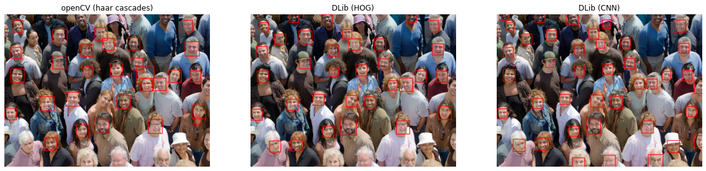

## Easy Face Detection
Introduction of simple-to-use face detection models


### 1. openCV - haar cascades
```python
import cv2

# Load model & img
detector = cv2.CascadeClassifier('./haarcascade_frontalface_default.xml')
img = cv2.imread('imgs/faces.jpeg')

# Face detection
faces = detector.detectMultiScale(gray, 1.1, 4)

# Grayscale to RGB
img = cv2.cvtColor(img, cv2.COLOR_BGR2RGB)

"""
Sample image "faces.jpeg"
- Wall time: 855 ms
- Detected faces: 29
"""
```

### 2. DLib - Histogram of Oriented Gradients (HOG)
```python
import cv2
import dlib

# Load model & img
detector = dlib.get_frontal_face_detector()
img = dlib.load_rgb_image(image_file)

# Face detection
faces = detector(img, 1)

"""
Sample image "faces.jpeg"
- Wall time: 492 ms
- Detected faces: 33
"""
```

### 3. DLib - Convolutional Neural Network (CNN)
```python
import cv2
import dlib

# Load model & img
detector = dlib.cnn_face_detection_model_v1('./mmod_human_face_detector.dat')
img = dlib.load_rgb_image(image_file)

# Face detection
faces = detector(img, 1)

"""
Sample image "faces.jpeg" 
- Wall time: 1min 13s
- Detected faces: 41
"""
```
#### Using the above 3 models, you can perform face detection very simply.



### 4. BlazeFace
```python
import cv2
import dlib

# Load model
net = BlazeFace()
net.load_weights("./blazeface.pth")
net.load_anchors("./anchors.npy")

# Optionally change the thresholds:
net.min_score_thresh = 0.75
net.min_suppression_threshold = 0.3

# Load image and resize image to (128, 128)
img = cv2.imread(image_file)
img = cv2.resize(img, (128, 128))

# Face detection
faces = net.predict_on_image(frame)

"""
Sample image "faces.jpeg" 
- Wall time: 108 ms
- Detected faces: 0
- !! BlazeFace doesn't work very well on small faces
"""
```


### 5. Multi-task Cascaded Convolutional Networks (MTCNN)
refer from this repository [mtcnn](https://github.com/ipazc/mtcnn)
```python
>>> from mtcnn import MTCNN
>>> import cv2
>>>
>>> img = cv2.cvtColor(cv2.imread("ivan.jpg"), cv2.COLOR_BGR2RGB)
>>> detector = MTCNN()
>>> detector.detect_faces(img)
[
    {
        'box': [277, 90, 48, 63],
        'keypoints':
        {
            'nose': (303, 131),
            'mouth_right': (313, 141),
            'right_eye': (314, 114),
            'left_eye': (291, 117),
            'mouth_left': (296, 143)
        },
        'confidence': 0.99851983785629272
    }
]
```
### 6. RetinaFace
refer from this repository [RetinaFace-tf2](https://github.com/StanislasBertrand/RetinaFace-tf2/edit/master/ReadMe.md)
```python
from retinaface import RetinaFace
import cv2

detector = RetinaFace("./data/retinafaceweights.npy", False, 0.4)
img = cv2.imread("./sample-images/WC_FR.jpeg")
faces, landmarks = detector.detect(img, 0.9)
```

## BENCHMARK

Environment
- tensorflow==2.1.0
- openCV==4.4.0
- GPU : tesla v100

mAP result on the [WIDERFACE](http://shuoyang1213.me/WIDERFACE/) validation dataset:  

| Model  | Easy  | Medium  | Hard  |
|---|---|---|---|
| MTCNN | 95.6  | 94.6 | 88.5 |
| RetinaFace | 56.5  | 52.2  | 28.8  |

avrage inference time
| Model | time |
|---|---|
| MTCNN | 0.154 |
| RetinaFace | 0.188 |

## ACKNOWLEDGEMENTS
```  
@article{bazarevsky2019blazeface,
  title={Blazeface: Sub-millisecond neural face detection on mobile gpus},
  author={Bazarevsky, Valentin and Kartynnik, Yury and Vakunov, Andrey and Raveendran, Karthik and Grundmann, Matthias},
  journal={arXiv preprint arXiv:1907.05047},
  year={2019}
}
```
```  
@article{zhang2016joint,
  title={Joint face detection and alignment using multitask cascaded convolutional networks},
  author={Zhang, Kaipeng and Zhang, Zhanpeng and Li, Zhifeng and Qiao, Yu},
  journal={IEEE Signal Processing Letters},
  volume={23},
  number={10},
  pages={1499--1503},
  year={2016},
  publisher={IEEE}
}
```
```  
@inproceedings{deng2020retinaface,
  title={Retinaface: Single-shot multi-level face localisation in the wild},
  author={Deng, Jiankang and Guo, Jia and Ververas, Evangelos and Kotsia, Irene and Zafeiriou, Stefanos},
  booktitle={Proceedings of the IEEE/CVF Conference on Computer Vision and Pattern Recognition},
  pages={5203--5212},
  year={2020}
}
```
